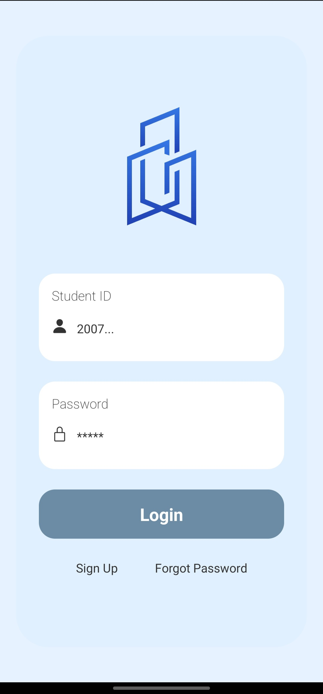
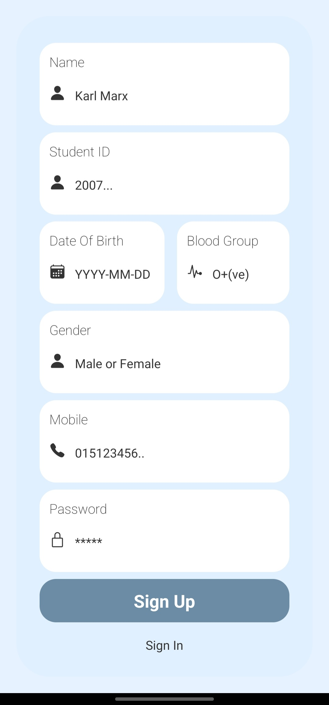
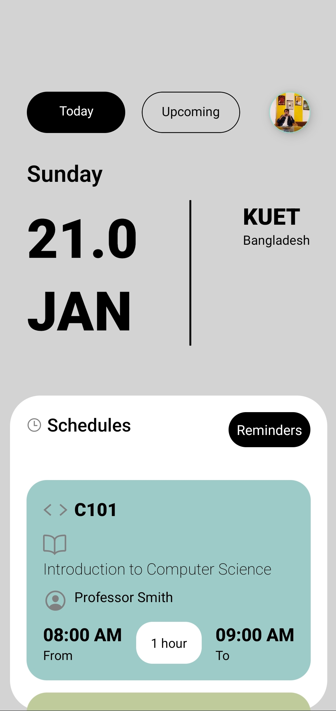
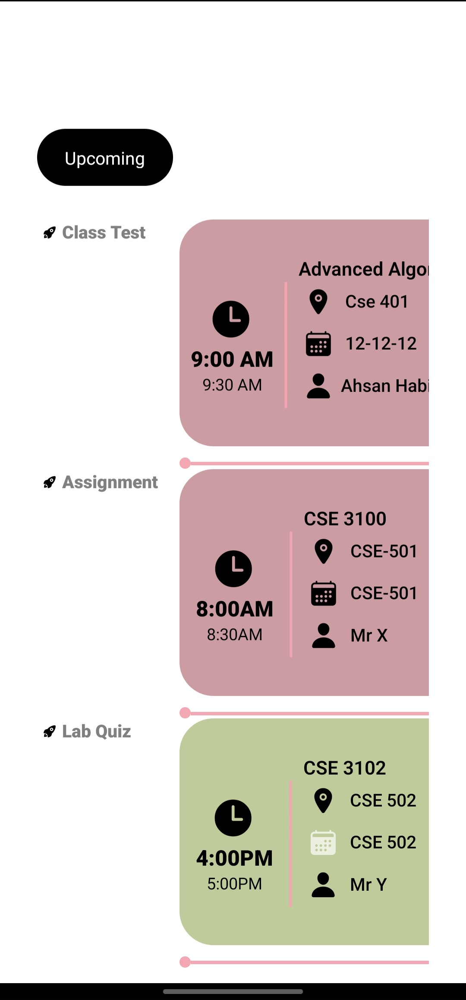
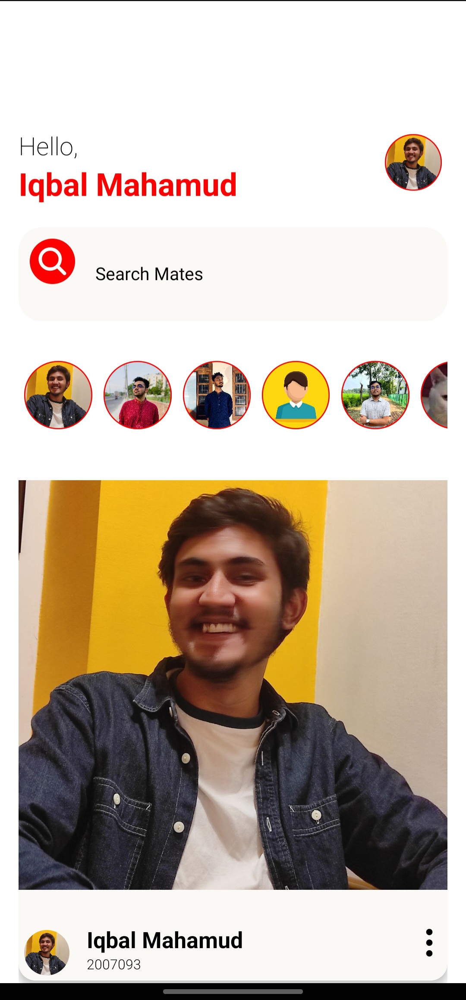
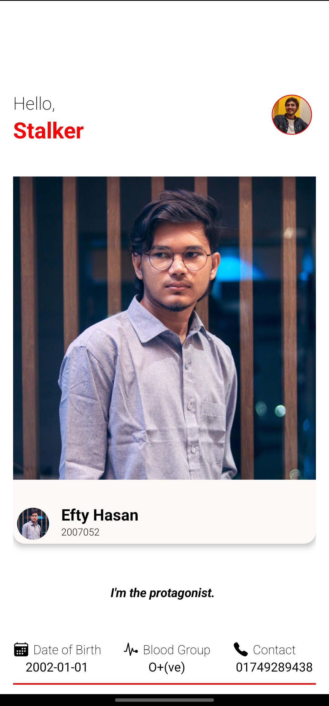

# Virtual Cr

Virtual Cr is an innovative React Native application crafted to streamline the student experience. Developed as part of an Advanced Programming lab project, it offers essential features to support students in their academic journey and social interactions.

## Features

- **Upcoming Schedules**: Stay updated on upcoming class tests, assignments, and lab sessions.
- **Daily Class Routine**: Easily navigate through the daily class schedule for a quick grasp of the day's agenda.
- **Classmate Communication**: Connect and communicate seamlessly with classmates.
- **Blood Group Search**: Find classmates by blood group, enhancing community support in emergencies.
- **Hall of Fame**: Celebrate peers' accomplishments in a dedicated space, fostering motivation and positivity.
- **Birthday Love**: Share personalized birthday messages and keep track of friends' special days.
- **Attendance Calculator**: Track attendance throughout the semester and calculate it accurately at the end.

Virtual Cr is designed to infuse vibrancy and enthusiasm into routine academic tasks, moving away from the monotony of traditional class routines.

## Screenshots

  
  
  
  
  
  

## License

This project is licensed under the MIT License - see the [LICENSE](LICENSE) file for details.

## Contributing

Contributions are welcome! If you have suggestions for new features or improvements, feel free to fork the repository and submit a pull request.

## Acknowledgements

- Thanks to the Advanced Programming Lab instructors and peers for their guidance and feedback.
- React Native and the open-source community for providing the necessary tools and documentation.

---

Made with 💙 by Iqbal Mahamud Moon for the Advanced Programming Lab.
